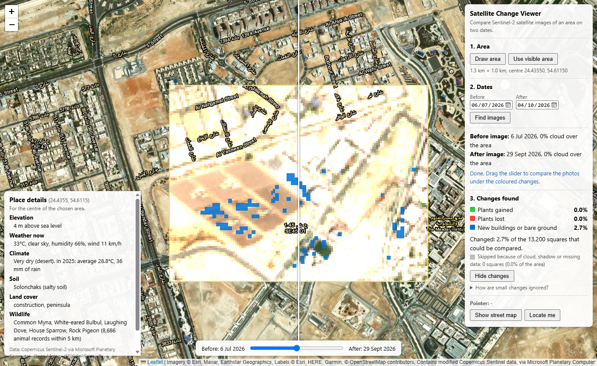

# Satellite Change Viewer

See what changed in a place over a few months, using free Sentinel-2 satellite images.

Draw an area on the map and pick two dates. The tool finds the clearest satellite photo near each date, lets you swipe between them, and colours in what changed: plants that grew or disappeared, and new buildings or bare ground.

**Live site: https://kwetemasego-sego.github.io/change-detection/**

It runs entirely in your web browser. There is no server and no API key: it is just HTML, CSS and JavaScript, hosted on GitHub Pages.



*A construction site in Masdar City, Abu Dhabi, between 6 July and 29 September 2026. The blue squares mark new buildings or bare ground (2.7% of the area). OpenStreetMap tags this spot as "construction" too, as the place details panel on the left shows.*

---

## How to use it

1. **Open the [live site](https://kwetemasego-sego.github.io/change-detection/)** and move the map to the place you're interested in.
2. **Choose an area**:
   - Press **Draw area**, then press and drag a box on the map, *or*
   - Press **Use visible area** to use everything on screen (easiest on phones).
3. **Choose two dates.** They start as today and 90 days ago. Change them if you like.
4. **Press Find images.** After a few seconds you'll see:
   - **Before image** and **After image**: the dates of the photos it chose, and how cloudy each was over your area.
   - **Changes found**: coloured squares on the map, and a summary in the panel.
   - **Place details** for the centre of your area: elevation, weather, climate, soil, land cover and wildlife.
5. **Drag the slider** at the bottom to swipe between the before photo (left of the line) and the after photo (right of the line).
6. **Press Hide changes** to see the photos without the coloured squares, and **Show changes** to bring them back.
7. **Over time**: after the changes, the panel looks for a clear photo about every 2 weeks between your two dates and charts the area's average **plant score (NDVI)** and **built-up score (NDBI)**.
   - **Click a point** on the chart to show that photo on the map, with its date at the top.
   - **Press Play** for a timelapse of all the photos in date order. **Speed** sets how long each one stays on screen.
   - **Back to before/after**, or moving the swipe slider, returns to the before/after comparison.
8. **Download** the results (made in your browser, nothing is uploaded):
   - **Download report** saves a PDF: a map of the changes on the after photo, the two images' dates and cloud, the summary in hectares and percentages, the time series chart (if it has finished loading), how the changes were found, the limits and the data credits.
   - **Download GeoJSON** saves the changed areas as map shapes for GIS software, or for viewing at [geojson.io](https://geojson.io/). Touching squares of the same kind of change are joined into one shape. Each shape has `change` (its kind), `area_ha`, `area_m2`, `squares`, and the two image dates, plus colours that geojson.io shows.

Tips:

- Areas of about **1 to 5 km** across work best. Changes are only worked out for areas up to **10 km × 10 km**. Bigger areas still show the photos.
- Building sites, new roads, farms and parks show changes best.
- **Show street map** switches the background map. **Locate me** shows where you are.

### The colours

| Colour | Meaning |
|---|---|
| 🟩 Green | Plants gained |
| 🟥 Red | Plants lost |
| 🟦 Blue | New buildings or bare ground (land cleared, dug up or built on) |
| Grey | Skipped: hidden by cloud, cloud shadow or missing data in one of the photos |

The summary gives each kind as a size on the ground and as a percentage of the squares that could be compared, and says how much was skipped. Each 10 m square counts as 100 m². Sizes are in square metres (m²) for small amounts and hectares (ha) for larger ones: a hectare is 10,000 m², a square 100 m long on each side. The total size of the chosen area is shown under **Area**.

---

## How the change detection works

### 1. Finding the clearest photos

Sentinel-2 is a group of European satellites that photograph the whole Earth every few days. Each photo covers a square about 110 km across.

- The tool asks the [Microsoft Planetary Computer](https://planetarycomputer.microsoft.com/) catalogue for every photo of your area taken within **20 days** of each date.
- It keeps only photos that cover your **whole** area.
- Clouds: a photo can be "3% cloudy" overall but have a cloud right over your area. So for the 6 most promising photos, the tool reads Sentinel-2's **scene classification band (SCL)**, which labels every 20 m pixel as cloud, shadow, water, plants, and so on. It then works out the cloud **over your area only**.
- Each photo gets a score: *cloud over your area (%)* plus *0.5 for every day away from your chosen date*. Lower is better.
- **Before and after are chosen as a matching pair.** Photos taken from the same satellite path see the ground from the same angle, so tall buildings lean the same way in both. A pair from different paths gets a large penalty, because towers leaning differently can make a city look changed when it isn't.

### 2. Reading the light bands

A Sentinel-2 photo is stored as several files, one per **band** (colour of light). The tool uses five:

| Band | Light | Pixel size | Why |
|---|---|---|---|
| B04 | Red | 10 m | Plants absorb red light |
| B08 | Near-infrared | 10 m | Plants reflect lots of this invisible light |
| B8A | Near-infrared (narrow) | 20 m | Paired with B11 for the built-up score |
| B11 | Short-wave infrared | 20 m | Bare ground, concrete and roofs reflect lots of this |
| SCL | Scene classification | 20 m | Labels cloud, shadow and water |

The files are **Cloud-Optimized GeoTIFFs**. The browser uses [geotiff.js](https://geotiffjs.github.io/) to download just the small block of pixels covering your area, usually a few MB, instead of the whole file of 200 MB or more.

The tool covers your area with a grid of **10 m squares** and looks up each band's value in every square. Sentinel-2 files use a flat map grid in metres called UTM, which is different in each 6° "zone" of the Earth. Abu Dhabi sits right on the edge between two zones, so [proj4js](https://github.com/proj4js/proj4js) converts every square's latitude and longitude into each photo's own grid.

### 3. Two scores for every square

For each date, every square gets two scores between −1 and +1:

- **NDVI, the plant greenness score** = (near-infrared − red) ÷ (near-infrared + red)
  Plants reflect much more near-infrared than red. About **0.5 or more** means lush plants, about **0.2** sparse plants, and **near 0 or below** sand, concrete or water.

- **NDBI, the built-up score** = (short-wave infrared − near-infrared) ÷ (short-wave infrared + near-infrared)
  Bare ground, concrete and roofs reflect lots of short-wave infrared, so this score goes up when land is cleared, dug up or built on. It uses B8A and B11, which both have 20 m pixels. Mixing a sharp 10 m band with a blurrier 20 m band makes false changes appear along every shadow edge.

### 4. Ignoring small and fake changes

Satellite photos of the same place are never exactly the same: haze, the sun's angle and the seasons all shift the scores a little. So a square only counts as changed if the change is big enough:

| Kind of change | Rule |
|---|---|
| **Plants gained** | NDVI rose by at least **0.15**, *and* the square looks like plants afterwards (NDVI **0.3** or more) |
| **Plants lost** | NDVI fell by at least **0.15**, *and* the square looked like plants before (NDVI **0.3** or more) |
| **New buildings or bare ground** | NDBI rose by at least **0.10** |

Some things change the scores without anything really changing, so these squares are left out:

- **Cloud, cloud shadow or missing data** in either photo. These are counted as *skipped*.
- **Water and shorelines** on either date. Tides, waves and wet mud make them look different from day to day.
- **Ground that was wet before.** It is dark in short-wave infrared (reflectance below **0.15**), and drying mud raises the built-up score.
- **Ground that fell into a new shadow.** It became less than **60%** as bright, which usually means a longer shadow from a tall building as the sun gets lower.

### 5. Ignoring lone squares

Real changes, like a building site or a cleared field, cover a patch of ground. A single changed square on its own is usually just noise. So **a changed square only stays if at least 2 of its 8 neighbours changed the same way.**

### 6. The time series

One catalogue search finds every photo between the two dates. Only photos from the **same satellite path and tile as the before photo** are kept, so they all line up. The dates are split into 2-week periods (longer for ranges over about 2 years, so there are never more than 60). In each period, up to 3 of the least cloudy photos are tried in turn. The first with **at most 10% of the area hidden** by cloud, shadow or missing data (the same scene-classification check as above) is used. Its averages leave out skipped squares and water.

To keep downloads small, the photo files aren't read directly for this. They store pixels in blocks about 10 km across, so even a small area would cost about 2 MB per photo. Instead Planetary Computer cuts out just the area, sampled at up to 100 × 100 points with all five bands in one small file (about 120 KB). A year of photos over a 2 km area is about 3.5 MB.

### How well does it work?

It was tested on six sites around Abu Dhabi (3 July to 1 October 2026): three with real change and three where nothing changed. **3 were correct, 2 partly correct and 1 wrong.**

- ✅ It found construction and earthworks in the right places (Masdar City, Lulu Island). Finished neighbourhoods stayed under 1% flagged (Al Khalidiyah, Khalifa City A).
- ⚠️ It **missed a plot covered in bright white fill**, because the built-up score went down instead of up. It also **flagged a solar panel field** at Masdar.
- ❌ In a park, **lawns greening after the summer** were flagged as plants gained. Compare the same month in two years to avoid seasonal changes.

Full results, pictures and how the sites were chosen: **[VALIDATION.md](VALIDATION.md)**.

All the numbers above are settings at the top of [`main.js`](main.js), so they're easy to adjust.

---

## Data sources

| What | Source | Key needed? |
|---|---|---|
| Sentinel-2 photos: search, map tiles and band files | [Microsoft Planetary Computer](https://planetarycomputer.microsoft.com/) (STAC catalogue, data tile service, and a free anonymous token for reading files) | No |
| Background map, street and place labels | [Esri](https://www.esri.com/) ArcGIS Online basemaps | No |
| Elevation, weather and climate | [Open-Meteo](https://open-meteo.com/) | No |
| Soil type | [ISRIC SoilGrids](https://soilgrids.org/) | No |
| Land cover | [OpenStreetMap](https://www.openstreetmap.org/) via the [Overpass API](https://overpass-api.de/) | No |
| Wildlife records | [GBIF](https://www.gbif.org/) | No |

Libraries: [Leaflet](https://leafletjs.com/) for the map, [geotiff.js](https://geotiffjs.github.io/) for reading the image files, [proj4js](https://github.com/proj4js/proj4js) for converting map coordinates, and [jsPDF](https://github.com/parallax/jsPDF) for the PDF report.

Sentinel-2 images contain modified Copernicus Sentinel data. Licences and full credits are in [CREDITS.md](CREDITS.md).

---

## Limits

- **Small things are missed.** Sentinel-2's sharpest pixels are 10 m across, and a change needs a small patch of squares, so anything smaller than about 20 m (a single villa, say) won't show. Zoomed in to street level, the photos look blurry for the same reason.
- **Water change and land reclamation aren't detected.** Shorelines are left out because tides make them unreliable over short periods.
- **Tall towers can cause a little false blue** at their feet as shadows change with the seasons (about 0.5% in a dense neighbourhood in testing).
- **Areas up to 10 km × 10 km** for change detection. Larger areas would download too much data into the browser.
- **The cloud check only uses the 6 most promising photos** near each date. If they are all cloudy over your area, try other dates.
- **The time series is an average over the whole area**, so a building site that covers a small part of it only moves the lines a little. Draw the area tightly around the place you're interested in.
- **It depends on free public services.** If Planetary Computer, Open-Meteo, SoilGrids, Overpass or GBIF are busy or down, that part shows a message or "Not available" while the rest keeps working. Planetary Computer's tile service is meant for exploring data and limits how many requests it accepts.
- **It's a quick visual guide, not a survey.** Always check the before and after photos with the slider before drawing conclusions.

---

## Running it on your own computer

You need [Python](https://www.python.org/) (or any simple web server).

```
git clone https://github.com/kwetemasego-sego/change-detection.git
cd change-detection
python -m http.server 8000
```

Then open **http://localhost:8000** in your browser. Press **Ctrl+C** in the terminal to stop the server. **Locate me** only works on `localhost` or `https://` pages.

### Files

| File | What it does |
|---|---|
| `index.html` | The page: map, control panel, slider and place details panel |
| `style.css` | How everything looks |
| `main.js` | All the code: map, choosing an area and dates, finding images, reading bands, change detection, time series and timelapse, downloads, swipe slider, place details |
| `CREDITS.md` | Data sources, libraries and licences |
| `VALIDATION.md` | Test results on six sites around Abu Dhabi |
| `docs/validation/` | Before, after and result pictures for each test site |
| `docs/masdar-result.png` | The screenshot in this README |

The project started as a browser game. That version is kept on the [`game-version`](https://github.com/kwetemasego-sego/change-detection/tree/game-version) branch.
