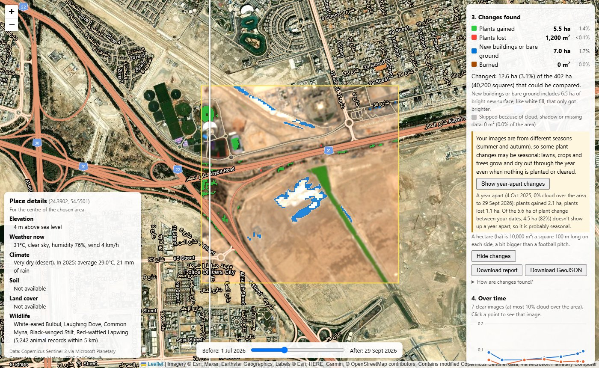
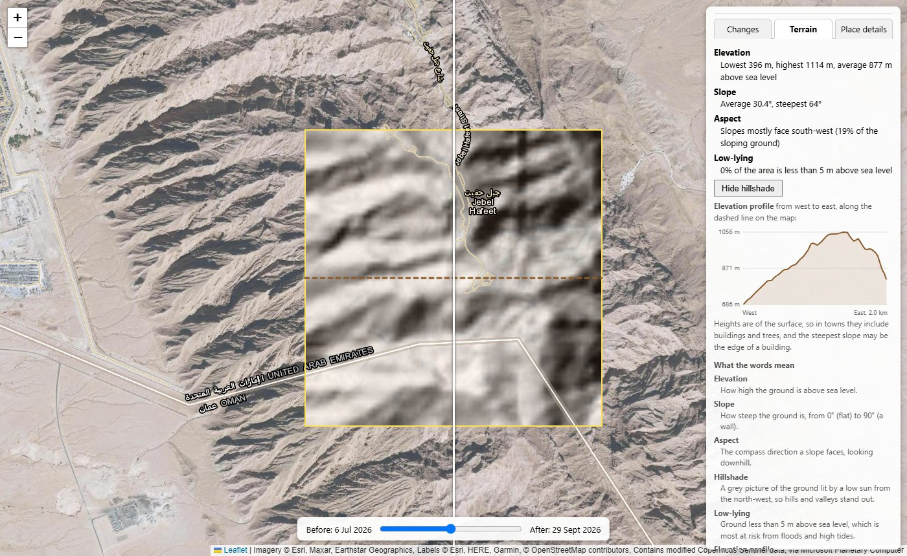

# TerraShift

[](https://github.com/kwetemasego-sego/terrashift/actions/workflows/tests.yml)
[](https://github.com/kwetemasego-sego/terrashift/releases/latest)

**See how the land changes.**

TerraShift shows what changed in a place over a few months, using free Sentinel-2 satellite images, and what its terrain is like.

Draw an area on the map, or click a spot, and pick two dates. The tool finds the clearest satellite photo near each date, lets you swipe between them, and colours in what changed: plants that grew or disappeared, new buildings or bare ground, and burned land. It warns when plant changes may just be the seasons, and can check them against a year earlier. For the same area it also works out the terrain from a 30 m elevation model: how high, how steep, which way slopes face, how much is low-lying, a hillshade and an elevation profile.

**Live site: https://kwetemasego-sego.github.io/terrashift/** (an introduction, with real before/after pictures and examples)

**Open the tool: https://kwetemasego-sego.github.io/terrashift/app/**

It runs entirely in your web browser. There is no server and no API key: it is just HTML, CSS and JavaScript, hosted on GitHub Pages.



*Khalifa City south, Abu Dhabi, between 1 July and 29 September 2026. Blue marks a plot newly covered in white fill (found as a bright new surface) and green a planted strip that grew. The two photos are from summer and autumn, so the panel warns that some plant change may be seasonal; compared with a year earlier, 82% of it probably is.*

---

## How to use it

1. **Open [the tool](https://kwetemasego-sego.github.io/terrashift/app/)** (or press **Launch TerraShift** on the [home page](https://kwetemasego-sego.github.io/terrashift/)) and go to the place you're interested in: move the map, or type a place name in the search box and press **Search** (or Enter). If more than one place matches, they're listed below the box: click one to go there.
   - Or press one of the **examples** (*Khalifa City: white fill*, *Lulu Island: earthworks*, *Al Mushrif: seasonal greening*). Each one sets an area and dates from the [validation tests](VALIDATION.md) and finds the images straight away.
2. **Choose an area**:
   - Press **Draw area**, then press and drag a box on the map, *or*
   - Press **Use visible area** to use everything on screen (easiest on phones), *or*
   - Press **Click to analyse** (it turns blue) and click anywhere on the map. It draws a square around the spot (2 km across, or 1 or 5 km if you choose under **Square**) and runs everything straight away, for the last 90 days unless you've changed the dates yourself. Until you press the button again (or **Draw area**), each click on the map analyses a new square, and double-clicks don't zoom.
3. **Choose two dates.** They start as today and 90 days ago. Change them if you like.
4. **Press Find images.** After a few seconds you'll see the **Before image** and **After image** (the dates of the photos it chose, and how cloudy each was over your area), and the results in three tabs:
   - **Changes**: coloured squares on the map, a summary, and the chart over time (steps 6 and 7).
   - **Terrain**: the area's height, slopes and low-lying ground, a hillshade and an elevation profile (see [Terrain](#terrain) below).
   - **Place details** for the centre of your area: elevation, weather, climate, soil, land cover and wildlife.

   Terrain and Place details appear as soon as you choose an area, without waiting for the images.
5. **Drag the slider** at the bottom to swipe between the before photo (left of the line) and the after photo (right of the line).
6. **Press Hide changes** to see the photos without the coloured squares, and **Show changes** to bring them back.
   - If the two photos are from **different seasons** (say summer and autumn), a yellow note warns that some plant changes may just be the time of year. Press **Compare with a year earlier** to check: the after photo is compared with one from the same time a year before (from the same satellite path if possible). The note then says how much of your plant change doesn't show up a year apart, so is probably seasonal. **Show year-apart changes** puts that comparison on the map, and **Show your dates' changes** switches back.
7. **Over time**: after the changes, the panel looks for a clear photo about every 2 weeks between your two dates and charts the area's average **plant score (NDVI)** and **built-up score (NDBI)**.
   - **Click a point** on the chart to show that photo on the map, with its date at the top.
   - **Press Play** for a timelapse of all the photos in date order. **Speed** sets how long each one stays on screen.
   - **Back to before/after**, or moving the swipe slider, returns to the before/after comparison.
8. **Download** the results (made in your browser, nothing is uploaded):
   - **Download report** saves a PDF: a map of the changes on the after photo, the two images' dates and cloud, the summary in hectares and percentages (with how much was bright new surface), the seasonal warning and the year-apart check if they apply, the time series chart (if it has finished loading), the terrain results and elevation profile (if they have loaded), how the changes were found, the limits and the data credits.
   - **Download GeoJSON** saves the changed areas as map shapes for GIS software, or for viewing at [geojson.io](https://geojson.io/). Touching squares of the same kind of change are joined into one shape. Each shape has `change` (its kind), `area_ha`, `area_m2`, `squares`, and the two image dates, plus colours that geojson.io shows.

### Sharing a search

Press **Copy link** (next to **Find images**) to copy a web address with your area and dates in it. Anyone who opens it sees the same area and dates, and the search runs by itself. The address in your browser's address bar also updates each time you press **Find images**, so you can bookmark it too. A link looks like this:

```
https://kwetemasego-sego.github.io/terrashift/app/?area=24.38120,54.54020,24.39920,54.56000&before=2026-07-03&after=2026-10-01
```

`area` is the box's south, west, north and east edges (latitude and longitude), and `before` and `after` are the dates. If you were on the **Terrain** or **Place details** tab, the link ends with `&tab=terrain` or `&tab=place` and opens on that tab. The terrain is worked out again for whoever opens it. If a link's area or dates don't make sense (say the before date is later than the after date), the page says so and waits for you to choose.

Older links without `/app/` (from before the home page was added) still work: the home page sends them on to the tool with the same area, dates and tab.

### Terrain

The **Terrain** tab uses the free Copernicus DEM (GLO-30), a map of heights every 30 m for the whole world, read straight from Microsoft Planetary Computer like the satellite bands. It shows:

| Result | What it means |
|---|---|
| **Elevation** | How high the ground is above sea level: the lowest, highest and average height in the area |
| **Slope** | How steep the ground is, from 0° (flat) to 90° (a wall): the average and the steepest |
| **Aspect** | The compass direction a slope faces, looking downhill. The tool gives the direction most sloping ground faces, ignoring ground flatter than 2°, or says the area is too flat to face any one way |
| **Low-lying** | Ground less than 5 m above sea level, which is most at risk from floods and high tides: the share of the area that is |
| **Hillshade** | A grey picture of the ground lit by a low sun from the north-west, so hills and valleys stand out. **Show hillshade** puts it over the map, and **Hide hillshade** takes it off |
| **Elevation profile** | A chart of how high the ground is along a line across the square, from west to east through the middle. The line is drawn dashed on the map while the Terrain tab is open |

Slope and aspect come from comparing each 30 m square's height with its neighbours to the east, west, north and south. Terrain is worked out for areas up to 20 km × 20 km.



*Jebel Hafeet near Al Ain: 396 to 1,114 m high, with an average slope of 30° and a steepest of 64°, and the hillshade on. On flat ground at Khalifa City south the same size of square is 1 to 19 m high, with an average slope of 1.8°, and 78% of it is low-lying.*

Tips:

- Areas of about **1 to 5 km** across work best. Changes are only worked out for areas up to **10 km × 10 km**. Bigger areas still show the photos.
- Building sites, new roads, farms and parks show changes best.
- **Show street map** switches the background map. **Locate me** shows where you are.

### The colours

| Colour | Meaning |
|---|---|
| 🟩 Green | Plants gained |
| 🟥 Red | Plants lost |
| 🟦 Blue | New buildings or bare ground (land cleared, dug up, built on or covered in bright fill) |
| 🟫 Dark orange | Burned (plants burned by a fire) |
| Grey | Skipped: hidden by cloud, cloud shadow or missing data in one of the photos |

The summary gives each kind as a size on the ground and as a percentage of the squares that could be compared, and says how much was skipped. Each 10 m square counts as 100 m². Sizes are in square metres (m²) for small amounts and hectares (ha) for larger ones: a hectare is 10,000 m², a square 100 m long on each side. The total size of the chosen area is shown under **Area**.

---

## How the change detection works

### 1. Finding the clearest photos

Sentinel-2 is a group of European satellites that photograph the whole Earth every few days. Each photo covers a square about 110 km across.

- The tool asks the [Microsoft Planetary Computer](https://planetarycomputer.microsoft.com/) catalogue for every photo of your area taken within **20 days** of each date.
- It keeps only photos that cover your **whole** area.
- Clouds: a photo can be "3% cloudy" overall but have a cloud right over your area. So for the 6 most promising photos, the tool reads Sentinel-2's **scene classification band (SCL)**, which labels every 20 m pixel as cloud, shadow, water, plants, and so on. It then works out the cloud **over your area only**.
- Each photo gets a score: *cloud over your area (%)* plus *0.5 for every day away from your chosen date*. Lower is better.
- **Before and after are chosen as a matching pair.** Photos taken from the same satellite path see the ground from the same angle, so tall buildings lean the same way in both. A pair from different paths gets a large penalty, because towers leaning differently can make a city look changed when it isn't.

### 2. Reading the light bands

A Sentinel-2 photo is stored as several files, one per **band** (colour of light). The tool uses eight:

| Band | Light | Pixel size | Why |
|---|---|---|---|
| B02, B03 | Blue, green | 10 m | With red, they give visible brightness, which shows bright new surfaces like white fill |
| B04 | Red | 10 m | Plants absorb red light |
| B08 | Near-infrared | 10 m | Plants reflect lots of this invisible light |
| B8A | Near-infrared (narrow) | 20 m | Paired with B11 for the built-up score, and with B12 for the burn ratio |
| B11 | Short-wave infrared | 20 m | Bare ground, concrete and roofs reflect lots of this |
| B12 | Longer short-wave infrared | 20 m | Burned ground reflects this about as well as before, while plants' near-infrared glow disappears |
| SCL | Scene classification | 20 m | Labels cloud, shadow and water |

The files are **Cloud-Optimized GeoTIFFs**. The browser uses [geotiff.js](https://geotiffjs.github.io/) to download just the small block of pixels covering your area, usually a few MB, instead of the whole file of 200 MB or more.

The tool covers your area with a grid of **10 m squares** and looks up each band's value in every square. Sentinel-2 files use a flat map grid in metres called UTM, which is different in each 6° "zone" of the Earth. Abu Dhabi sits right on the edge between two zones, so [proj4js](https://github.com/proj4js/proj4js) converts every square's latitude and longitude into each photo's own grid.

### 3. Three scores for every square

For each date, every square gets three scores between −1 and +1, and a **visible brightness**: the average of its blue, green and red reflectance.

- **NDVI, the plant greenness score** = (near-infrared − red) ÷ (near-infrared + red)
  Plants reflect much more near-infrared than red. About **0.5 or more** means lush plants, about **0.2** sparse plants, and **near 0 or below** sand, concrete or water.

- **NDBI, the built-up score** = (short-wave infrared − near-infrared) ÷ (short-wave infrared + near-infrared)
  Bare ground, concrete and roofs reflect lots of short-wave infrared, so this score goes up when land is cleared, dug up or built on. It uses B8A and B11, which both have 20 m pixels. Mixing a sharp 10 m band with a blurrier 20 m band makes false changes appear along every shadow edge.

- **NBR, the burn ratio** = (near-infrared − longer short-wave infrared) ÷ (near-infrared + longer short-wave infrared)
  Healthy plants reflect lots of near-infrared and little of the longer short-wave infrared (B12). Fire flips that: charred ground is dark in near-infrared but not in B12, so NBR drops sharply after a burn. It uses B8A and B12, both 20 m.

### 4. Ignoring small and fake changes

Satellite photos of the same place are never exactly the same: haze, the sun's angle and the seasons all shift the scores a little. So a square only counts as changed if the change is big enough:

| Kind of change | Rule |
|---|---|
| **Plants gained** | NDVI rose by at least **0.15**, *and* the square looks like plants afterwards (NDVI **0.3** or more) |
| **Plants lost** | NDVI fell by at least **0.15**, *and* the square looked like plants before (NDVI **0.3** or more) |
| **New buildings or bare ground** | NDBI rose by at least **0.10** (except on the look-alikes below), *or* it is a bright new surface (see 4b) |
| **Burned** | NBR fell by at least **0.27**, *and* there were some plants to burn (NDVI **0.15** or more before). This is checked first, because a fire also makes plants disappear |

**Why 0.27 for burns?** On the usual scale for burn severity, a drop in NBR of about 0.1 to 0.27 means a light burn, and 0.27 or more a moderate or severe one. Smaller drops can come from plants drying out, haze or a harvest, so only clear burns are counted.

Some things change the scores without anything really changing, so these squares are left out:

- **Cloud, cloud shadow or missing data** in either photo. These are counted as *skipped*.
- **Water and shorelines** on either date. Tides, waves and wet mud make them look different from day to day.
- **Ground that was wet before.** It is dark in short-wave infrared (reflectance below **0.15**), and drying mud raises the built-up score.
- **Ground that fell into a new shadow.** It became less than **60%** as bright, which usually means a longer shadow from a tall building as the sun gets lower.

For burns, two look-alikes are ruled out:

- **Shadows, water and new dark roofs** get darker in *every* band, including B12. Burned ground doesn't, so a square that became less than **60%** as bright in B12 isn't counted as burned.
- **Wet mud drying out** (tidal flats) also lowers NBR, but it gets *brighter* in near-infrared. Burning always makes ground reflect less near-infrared, so a square must get darker in near-infrared to count as burned.

**Surfaces that were already dark.** Solar panels, dark roofs and asphalt change with dust, cleaning and the light. When dust is washed off a solar panel field it gets darker in near-infrared more than in short-wave infrared, so NDBI goes up, although nothing new was built. So a square isn't counted as new buildings or bare ground if it was **already dark** before (less than **80%** as bright as the area's typical ground) *and* only **got darker** (in visible light, compared with the area as a whole, and in short-wave infrared). Ground that was bright before, like sand that new panels or a dark roof are put on, still counts.

### 4b. Bright new surfaces

White fill, fresh sand, gravel and new concrete make a plot much brighter in visible light, but often not in short-wave infrared, so NDBI can even go **down** and the rules above miss them. So a square that didn't change by those rules also counts as **new buildings or bare ground** if:

| Check | Why |
|---|---|
| Its visible brightness rose at least **30%** more than the area's typical change | Haze and the sun's angle brighten or dim the whole area, so each square is compared with the middle value over the area's clear land, not with a fixed number |
| It ends up at least **15%** brighter than the area's typical ground | It is a *bright* new surface, not ordinary ground that was dark before |
| It brightened more in visible light than in short-wave infrared | Wet ground drying out brightens most in short-wave infrared, because water absorbs it |
| It wasn't wet before, or in a shadow that went away | The same checks as above, the other way round |
| It is more than **30 m** from water and **20 m** from plants | Tides wet and dry the sand by the shore, and watering wets the ground beside lawns and trees |
| It is part of a patch of at least **25 squares (2,500 m²)** | Brightening alone is a weaker sign than the scores. Fill is spread over plots, while a single repainted roof or a parked lorry is smaller |
| It isn't on a slope of **15° or more** (from the [terrain](#terrain)) | The sun lights steep slopes much more or less brightly as it gets higher or lower through the year, so on a mountain, brightening is usually just the light. On Jebel Hafeet this removed 4.3 ha of false "bright new surface" between July and September, and it changed nothing at the other test sites |

The summary says how much of the blue was found this way, and how much brightening on steep slopes was left out. The search uses the terrain already read for the area; if it couldn't be read, the slope check is skipped and the summary says so.

### 4c. Seasons

Between summer and autumn, or winter and spring, lawns, crops and trees grow and dry out without anything being planted or cleared, and that shows as plants gained or lost. So when the two photos are from different seasons (weather seasons: December to February is winter in the north, and the other way round south of the equator), the panel shows a warning.

**Compare with a year earlier** checks this. It looks for a clear photo within 20 days of exactly a year before the after photo, from the same satellite path if there is one, and compares it with the after photo using the same rules. Squares with plant change between your dates that *don't* change the same way a year apart are probably seasonal. Squares the year-apart check couldn't see because of cloud aren't counted either way.

### 5. Ignoring lone squares

Real changes, like a building site or a cleared field, cover a patch of ground. A single changed square on its own is usually just noise. So **a changed square only stays if at least 2 of its 8 neighbours changed the same way.** Bright new surfaces must also form a patch of at least 25 squares (see 4b).

### 6. The time series

One catalogue search finds every photo between the two dates. Only photos from the **same satellite path and tile as the before photo** are kept, so they all line up. The dates are split into 2-week periods (longer for ranges over about 2 years, so there are never more than 60). In each period, up to 3 of the least cloudy photos are tried in turn. The first with **at most 10% of the area hidden** by cloud, shadow or missing data (the same scene-classification check as above) is used. Its averages leave out skipped squares and water.

To keep downloads small, the photo files aren't read directly for this. They store pixels in blocks about 10 km across, so even a small area would cost about 2 MB per photo. Instead Planetary Computer cuts out just the area, sampled at up to 100 × 100 points with the six bands it needs (not blue and green) in one small file (about 120 KB). A year of photos over a 2 km area is about 3.5 MB.

### How well does it work?

It was tested on nine sites (3 July to 1 October 2026): six around Abu Dhabi, a new town south of the city, a solar park in Dubai and the mountain Jebel Hafeet. **5 were correct, 2 partly correct and 2 wrong.** The first six were also tested before the rules for bright surfaces, dark surfaces and seasons were added (then: 3 correct, 2 partly, 1 wrong).

- ✅ It found earthworks and white fill in the right places (Lulu Island, most of a white plot at Khalifa City), and panels put back into three blocks of the Dubai solar park. Finished neighbourhoods stayed under 1% flagged (Al Khalidiyah, Khalifa City A), and so did the mountain Jebel Hafeet (0.1%), once brightening on steep slopes was left out.
- ⚠️ False alarms on Masdar's solar panel field fell from about 3 ha to under 1 ha, but less of Masdar's construction is found too. The centre of the white plot, which was wet before, is still missed.
- ❌ **Scattered new villas** (Riyadh City) are too small to find. In a park, **lawns greening after the summer** are still flagged as plants gained, but the page warns about it, and the year-apart check put 73% of it down as probably seasonal.
- 🔥 **Burns** were tested on the 2025 Palisades fire in Los Angeles. **99.7%** of the squares marked burned were inside the official fire perimeter. **64%** of the burned land was marked burned, and another 21% as plants lost. Around Abu Dhabi almost nothing was marked burned (0.1% or less), even on tidal mud, solar panels and winter tower shadows.

Full results, pictures and how the sites were chosen: **[VALIDATION.md](VALIDATION.md)**.

All the numbers above are settings at the top of [`app/main.js`](app/main.js), so they're easy to adjust.

---

## Data sources

| What | Source | Key needed? |
|---|---|---|
| Sentinel-2 photos: search, map tiles and band files | [Microsoft Planetary Computer](https://planetarycomputer.microsoft.com/) (STAC catalogue, data tile service, and a free anonymous token for reading files) | No |
| Background map, street and place labels | [Esri](https://www.esri.com/) ArcGIS Online basemaps | No |
| Elevation, weather and climate | [Open-Meteo](https://open-meteo.com/) | No |
| Soil type | [ISRIC SoilGrids](https://soilgrids.org/) | No |
| Land cover | [OpenStreetMap](https://www.openstreetmap.org/) via the [Overpass API](https://overpass-api.de/) | No |
| Wildlife records | [GBIF](https://www.gbif.org/) | No |
| Elevation (Terrain tab) | [Copernicus DEM GLO-30](https://planetarycomputer.microsoft.com/dataset/cop-dem-glo-30) via Microsoft Planetary Computer (with a free signed address for each file) | No |
| Place search | [Nominatim](https://nominatim.org/), with © [OpenStreetMap](https://www.openstreetmap.org/copyright) contributors' data. Following its [usage policy](https://operations.osmfoundation.org/policies/nominatim/): it only searches when you press Search, never more than once a second, keeps answers instead of asking twice, and shows its credit | No |

Libraries: [Leaflet](https://leafletjs.com/) for the map, [geotiff.js](https://geotiffjs.github.io/) for reading the image files, [proj4js](https://github.com/proj4js/proj4js) for converting map coordinates, and [jsPDF](https://github.com/parallax/jsPDF) for the PDF report.

Sentinel-2 images contain modified Copernicus Sentinel data. Licences and full credits are in [CREDITS.md](CREDITS.md).

---

## Limits

- **Small things are missed.** Sentinel-2's sharpest pixels are 10 m across, and a change needs a small patch of squares, so anything smaller than about 20 m (a single villa, say) won't show. Zoomed in to street level, the photos look blurry for the same reason.
- **Water change and land reclamation aren't detected.** Shorelines are left out because tides make them unreliable over short periods.
- **Tall towers can cause a little false blue** at their feet as shadows change with the seasons (about 0.5% in a dense neighbourhood in testing).
- **Bright fill on ground that was wet before isn't counted.** Wet ground drying out also turns pale, and from space the two look the same, so wet ground is always left out.
- **Changes to surfaces that were already dark can be missed**, for example new panels added to an old solar farm, because those are left out to stop dust and cleaning looking like change.
- **Terrain heights are of the surface, not the bare ground.** The elevation model includes buildings and trees, so in towns the steepest slope is often the edge of a building. Heights are 30 m apart, so small features are smoothed out. "Low-lying" only uses the height above sea level: it doesn't know about sea walls or drains.
- **Steep ground.** Brightening on slopes of 15° or more isn't counted as a bright new surface, because there it's usually the sun lighting the slope differently. So bright fill on a steep slope (terraced earthworks, say) would be missed. On very steep slopes the built-up score can still show a little false change as the light moves (0.3 ha on Jebel Hafeet between July and September). Check mountain results with the slider.
- **Seasons**: lawns, crops and trees greening or drying out show as plants gained or lost. The panel warns when the photos are from different seasons, and **Compare with a year earlier** shows how much is probably seasonal.
- **Areas up to 10 km × 10 km** for change detection. Larger areas would download too much data into the browser.
- **The cloud check only uses the 6 most promising photos** near each date. If they are all cloudy over your area, try other dates.
- **The time series is an average over the whole area**, so a building site that covers a small part of it only moves the lines a little. Draw the area tightly around the place you're interested in.
- **It depends on free public services.** If Planetary Computer (images and elevation), Open-Meteo, SoilGrids, Overpass, GBIF or Nominatim are busy or down, that part shows a message or "Not available" while the rest keeps working. Planetary Computer's tile service is meant for exploring data and limits how many requests it accepts.
- **It's a quick visual guide, not a survey.** Always check the before and after photos with the slider before drawing conclusions.

## Responsible use

- The tool uses **public satellite data at 10 m resolution**: each square is 10 m across, about the size of a house.
- At that detail it **can't identify people or vehicles**.
- **Don't use it to watch individuals or private property.** It's for seeing how land changes: building sites, farms, parks, fires.
- **A person should check the results before anyone acts on them.** The tool makes mistakes (see [VALIDATION.md](VALIDATION.md)), so look at the before and after photos first.

---

## Running it on your own computer

You need [Python](https://www.python.org/) (or any simple web server).

```
git clone https://github.com/kwetemasego-sego/terrashift.git
cd terrashift
python -m http.server 8000
```

Then open **http://localhost:8000** in your browser for the home page, or **http://localhost:8000/app/** for the tool. Press **Ctrl+C** in the terminal to stop the server. **Locate me** only works on `localhost` or `https://` pages.

## Running the tests

The tests open the site in **headless Chrome** (Chrome without a window) and check that it works. You need [Node.js](https://nodejs.org/) 22 or newer. The first time, install the test tool, [Puppeteer](https://pptr.dev/), which also downloads its own copy of Chrome (about 150 MB):

```
npm install
```

Then:

| Command | What it checks | Time | Needs the internet? |
|---|---|---|---|
| `npm run test:quick` | The page loads, and the change rules give the right answers on made-up data: white fill is found, small bright patches and cleaned solar panels aren't, seasons are worked out, the summary adds up. The terrain numbers on made-up heights: flat ground, a known 5.7° slope, which way slopes face, the hillshade, missing heights. The landing page (its pictures, slider, example links and footer, and that it fits a phone screen), and old links to the main address being forwarded to `/app/`. Also shared links (made, read back, bad ones refused, opening one starts the search, the tab kept), **Copy link**, the examples, **Click to analyse** (off and on, 1, 2 and 5 km squares, your own dates kept), the tabs, and the place search's rules (only on Search, at most once a second, answers kept, credit shown), using made-up place search answers | About 20 seconds | Only for the map libraries |
| `npm test` | The quick tests, plus one real site (Khalifa City south) run like a user would: real Sentinel-2 images, the white plot found, the seasonal warning and the year-apart check, the same site opened from a shared link, and the PDF report. Also real terrain for flat Khalifa City south and hilly Jebel Hafeet | About 1 minute | Yes |
| `npm run test:validation` | All nine sites from [VALIDATION.md](VALIDATION.md), each checked against what a good result looks like. The numbers are saved in `test-output/validation.json` | About 2 to 5 minutes | Yes |

Each test prints ✔ when it passes and ✖ with the reason when it fails. Riyadh City is marked as a known miss ("TODO"): it is reported but doesn't make the run fail.

The real-image tests depend on Microsoft Planetary Computer. If it is busy or down they can fail even though nothing is wrong with the code; they try each site 3 times first, waiting 30 and then 60 seconds between tries. The service also limits how often its free access passes can be asked for, so the site keeps each pass until shortly before it runs out (about an hour) instead of asking for a new one at every search, and if it is told "too many requests" (error 429) it waits and asks again.

### Automatic tests on GitHub

**GitHub Actions** is GitHub's robot helper. Each time code is pushed to GitHub, it borrows a fresh computer, downloads the project, installs everything and runs `npm test`. The result shows as a green ✔ or red ✖ next to each commit, and in the **Tests** badge at the top of this page. If a change breaks something, you find out straight away instead of a visitor finding it on the live site. The instructions it follows are in [`.github/workflows/tests.yml`](.github/workflows/tests.yml).

The full validation asks the free image service for a lot of data, so instead of on every push [`.github/workflows/validation.yml`](.github/workflows/validation.yml) runs it every Monday. You can also start it yourself: open the **Actions** tab, choose **Validation**, then **Run workflow**. Its numbers can be downloaded from the run's page.

### Releases

A **release** is a named snapshot of the project at a moment when it worked, like "version 1.0", with a short note saying what's in it. It is marked by a **tag**, a label stuck on one commit. You can always go back to it, download it as a zip, or compare later versions with it. Releases are listed on the [Releases page](https://github.com/kwetemasego-sego/terrashift/releases).

### Files

| File | What it does |
|---|---|
| `index.html` | The home page at the main address: what TerraShift does, with real pictures, examples and limits. It also forwards old shared links (the main address with `?area=…`) to the tool |
| `landing.css`, `landing.js` | How the home page looks, and its before/after slider |
| `app/index.html` | The tool's page: map, control panel with the result tabs, and slider |
| `app/style.css` | How the tool looks |
| `app/main.js` | All the tool's code: map, choosing an area (including Click to analyse) and dates, place search, examples and links, finding images, reading bands, change detection, terrain, time series and timelapse, downloads, swipe slider, place details |
| `CREDITS.md` | Data sources, libraries and licences |
| `VALIDATION.md` | Test results on nine sites, before and after the latest rule changes |
| `docs/validation/` | Before, after and result pictures for each test site |
| `docs/screenshot.jpg`, `docs/terrain.jpg` | The screenshots in this README |
| `docs/landing/` | The screenshots on the home page, all taken from the tool |
| `tests/` | The browser tests: `unit.test.js` (quick, made-up data), `sharing.test.js` (links, place search and examples, with made-up place search answers), `terrain.test.js` (terrain numbers, Click to analyse and the tabs), `landing.test.js` (the home page and old links being forwarded), `smoke.test.js` (one real site), `validation.js` (all nine sites), `sites.js` (the sites and how to run one) and `helpers.js` (starts a web server and headless Chrome) |
| `package.json`, `package-lock.json` | The test tool (Puppeteer) and the test commands. The site itself doesn't need them |
| `.github/workflows/` | Instructions for GitHub Actions: the tests on every push, and the weekly validation |

The project started as a browser game. That version is kept on the [`game-version`](https://github.com/kwetemasego-sego/terrashift/tree/game-version) branch.
