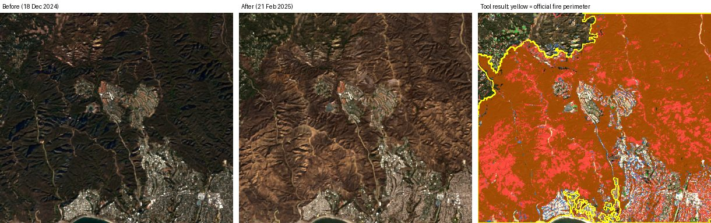
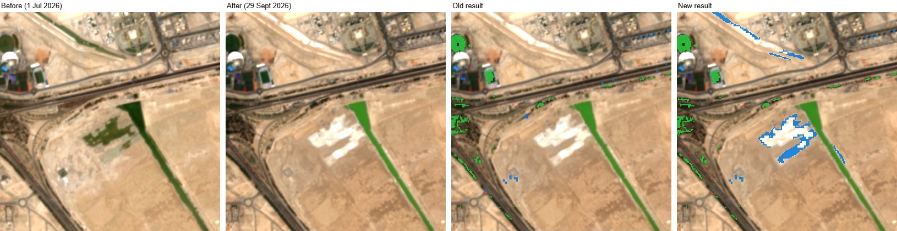
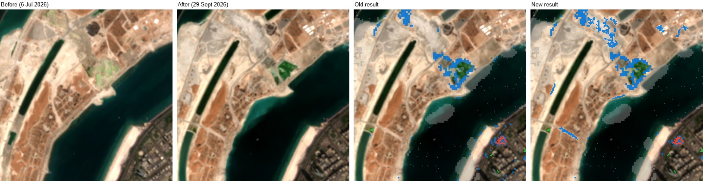
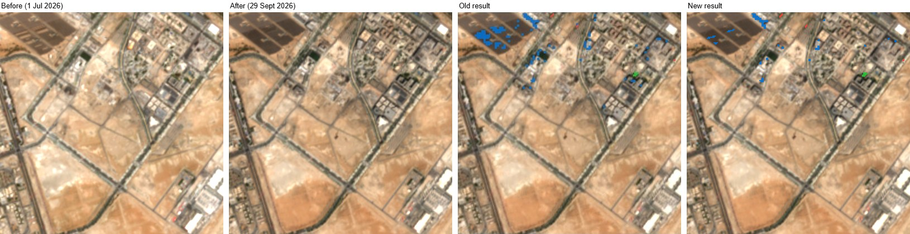
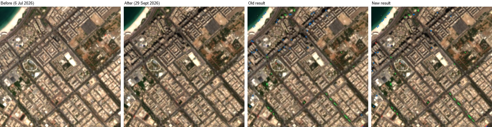
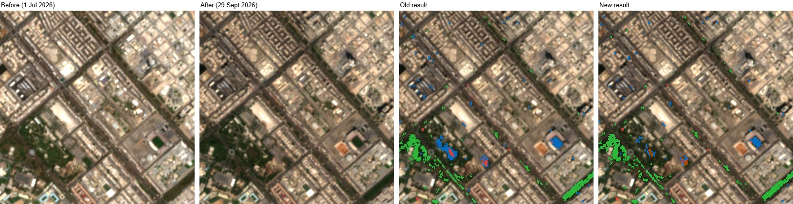
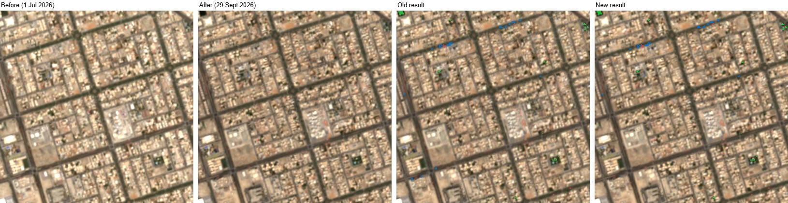

# Validation: does the change detection find real change?

Tested on **4 October 2026** on six sites around Abu Dhabi: three with real change and three where nothing should have changed. The dates were **3 July to 1 October 2026** (90 days) for every site. Each site was a box about **2 km × 2 km** (401 ha) centred on the coordinates below.

## Results

| # | Site | Centre (lat, lng) | Dates | Expected | What the tool found | Correct? |
|---|---|---|---|---|---|---|
| 1 | Khalifa City south (cleared plot) | 24.3902, 54.5501 | 3 Jul – 1 Oct 2026 (images 1 Jul, 29 Sep) | **Change**: a plot cleared and covered in bright white fill. A strip of planting turned greener | 6.5 ha changed (1.6%). Plants gained 5.5 ha, almost all on the greening strip and sports pitches. New buildings or bare ground 9,000 m², scattered. **The cleared white plot was not flagged** | ⚠️ Partly: found the greening, **missed the clearing** |
| 2 | Lulu Island (new park, lagoon, sand fill) | 24.4943, 54.3450 | 3 Jul – 1 Oct 2026 (images 6 Jul, 29 Sep) | **Change**: new park lawns, earthworks, white sand spread over bare ground | 10.6 ha changed (2.8%). New buildings or bare ground 9.7 ha, in patches on the earthworks and around the new park. 7% of the area skipped for thin cloud | ✅ Yes, in the right places. But the new park was labelled "new buildings or bare ground", not "plants gained" |
| 3 | Masdar City construction | 24.4270, 54.6150 | 3 Jul – 1 Oct 2026 (images 1 Jul, 29 Sep) | **Change**: buildings going up on construction plots | 4.9 ha changed (1.2%). New buildings or bare ground 4.6 ha. About 1.5 ha on the construction plots, but **about 3 ha on a solar panel field** that didn't change | ⚠️ Partly: found the construction, plus **false alarms on solar panels** |
| 4 | Al Khalidiyah (old neighbourhood) | 24.4690, 54.3500 | 3 Jul – 1 Oct 2026 (images 6 Jul, 29 Sep) | **No change** | 2.8 ha (0.7%), all in specks of 15 squares or fewer: dots beside tall towers (longer autumn shadows) and lines along tree-lined streets | ✅ Yes |
| 5 | Al Mushrif and Umm Al Emarat Park | 24.4560, 54.3860 | 3 Jul – 1 Oct 2026 (images 1 Jul, 29 Sep) | **No change** (established park and neighbourhood) | 14.2 ha (3.5%). Plants gained 8.7 ha on the park lawns and a tree-lined road, which grew greener after the summer. New buildings or bare ground 4.7 ha, in a few patches, one at a sports ground where a court was resurfaced | ❌ No: **too many false alarms** from lawns greening with the season |
| 6 | Khalifa City A (finished villas) | 24.4200, 54.5750 | 3 Jul – 1 Oct 2026 (images 1 Jul, 29 Sep) | **No change** | 1.4 ha (0.4%), in small specks (22 squares at most), a few along a road | ✅ Yes |

**Score: 3 correct, 2 partly correct, 1 wrong.** All 12 images used came from the same satellite path (so buildings lean the same way), with 0–7% cloud over the area.

### What counted as correct

These rules were set **before** running the tool:

- **Change sites**: correct if the flagged squares fall on the patch that visibly changed, as the right kind of change.
- **Stable sites**: correct if less than 1% of the area is flagged and there are no sizeable patches on ground that didn't change.

## In simple words

**What it does well**

- **It finds construction and earthworks in the right place.** At Masdar and Lulu Island the blue squares landed on the plots being built and the land being reworked.
- **Finished neighbourhoods stay quiet.** Al Khalidiyah and Khalifa City A had under 1% flagged, all in tiny specks. Tall towers with longer autumn shadows didn't cause big false patches.
- **Photos taken from the same satellite path** were found for every site, and clouds were handled. On Lulu Island 7% of the area was skipped, not guessed.

**Where it struggles**

- **Bright new surfaces can be missed.** The cleared plot south of Khalifa City got *brighter* in visible light but not in short-wave infrared, so the built-up score went **down** (from -0.02 to -0.11), not up. The tool only looks for that score going up. Fresh white sand, gravel or concrete can slip through.
- **Lawns and trees change with the seasons.** Between July and October, parks and street trees recover from the summer heat and get greener. The tool calls that "plants gained" (Umm Al Emarat Park, 8.7 ha). Comparing the same month in two different years avoids this.
- **Solar panels look like change.** Dust and cleaning change how panels reflect infrared light, so about 3 ha of Masdar's solar field was wrongly flagged as new buildings or bare ground.
- **The kind of change isn't always right.** A young park on Lulu Island was flagged as "new buildings or bare ground": the earthworks around the lawns changed more than the lawns grew.

**Bottom line**: a good first look for *where* to check, especially for building sites. But always look at the before and after photos with the slider before believing a result. Be most careful in parks, on solar farms, and where the ground turned bright white.

## Burned areas

Burn detection was added later (see the README for the rules) and tested separately.

### A real fire: Palisades, Los Angeles, January 2025

The Palisades fire started on 7 January 2025 and burned 23,449 acres (9,489 ha), both wild hillside scrub (Topanga State Park) and streets of houses (Pacific Palisades). The tool was run on a **7.4 km × 6.6 km box** (34.040 to 34.100 N, 118.600 to 118.520 W) with dates **10 December 2024 and 5 February 2025**. Those dates were chosen so the 20-day image search couldn't pick an image taken during the fire. It chose images from **18 December 2024 and 21 February 2025**, from the same satellite path, both with 0% cloud.

The result was compared with the **official fire perimeter** from CAL FIRE (4,322 ha of it falls inside the box):

| Measure | Result |
|---|---|
| Squares marked burned that are inside the official perimeter | **99.7%** (only 7 ha outside) |
| Burned land (inside the perimeter) marked **burned** | **64%** |
| ...marked as another change instead: plants lost / new buildings or bare ground | 21% / 3% |
| ...with no change marked | 13%. Perimeters also include patches that didn't burn, like the houses in Palisades Highlands that were saved |

**In simple words:** when it says "burned", it's almost always right. It finds most of a large fire, but some burned ground shows up as "plants lost" instead, mostly where pale ash made the ground brighter in near-infrared. The unburned village of Topanga, just outside the perimeter, was correctly left clear.

### Things that must not look like burns

The same rules were run on places with dark shadows, water, dark roofs and wet ground around Abu Dhabi, where there was no fire:

| Site | Dates | Why it's a trap | Marked burned |
|---|---|---|---|
| Al Khalidiyah | 10 Dec 2025 – 16 Jun 2026 | Long winter shadows from towers | 1,600 m² (<0.1%) |
| Masdar City | 1 Jul – 29 Sep 2026 | Dark solar panels, new dark roofs | 0 m² |
| Lulu Island | 6 Jul – 29 Sep 2026 | Water, new lagoon, fresh sand | 400 m² (<0.1%) |
| Fahid Island tidal flats | 6 Jul – 29 Sep 2026 | Wet mud with green algae, drying out | 4,900 m² (0.1%) |
| Al Mushrif and Umm Al Emarat Park | 1 Jul – 29 Sep 2026 | Lawns and trees | 4,000 m² (0.1%) |

The first version of the rules marked **11 ha of the Fahid tidal flats as burned**. Wet mud with a thin green film of algae looks like "plants" before, and drying out lowers NBR just like a fire. The band values were compared: the mud got **brighter** in near-infrared (median 1.6 times), while real burns got **darker** (median 0.7 times). So the rule "near-infrared must go down" was added. It removed 96% of those false burns, but it also moved about a fifth of the real Palisades burns into "plants lost", which is why 64% are marked burned rather than 79%. For a tool used mostly around coastal Abu Dhabi, avoiding false fires on tidal flats seemed worth it.

The six-site results above were recorded before burn detection was added. Re-running three of them (Masdar City, Lulu Island and Al Mushrif), the burn rule took a few squares from "plants lost" (at most 4,000 m² per site) and changed nothing else.

## How the sites were chosen

1. **Change sites.** Three construction or clearing sites were needed, found without using the tool itself:
   - A coarse scan of the whole Abu Dhabi area (100 m squares) listed places where the ground changed a lot between early July and late September.
   - Most of those turned out to be **natural**: salt flats whose white summer crust faded, and tidal mud drying out. So development districts were then searched by eye on 8 km wide before/after photos.
   - The three sites used are ones where **change was clearly visible** in the 10 m before and after photos.
2. **Stable sites.** Two neighbourhoods finished long ago, and one with an established park, also checked by eye to look unchanged.
3. **Running the tool.** Each site was run through the website in Chrome exactly as a user would, with the default settings.

The salt flats and tidal mud found during the search weren't run through the tool. The tool leaves out water and ground that was wet before, which should remove most tidal changes, but salt flats were not tested.

## Pictures

Each picture shows the before photo, the after photo, and the tool's result drawn on the after photo. Green = plants gained, red = plants lost, blue = new buildings or bare ground, grey = skipped.

**1. Khalifa City south**: the white cleared plot in the middle has no coloured squares.

**2. Lulu Island**: blue around the new park and on the earthworks at the top.

**3. Masdar City**: blue on the construction plots, and on the dark solar panels in the top-left corner.

**4. Al Khalidiyah**: only specks.

**5. Al Mushrif and Umm Al Emarat Park**: green on the park lawns (bottom left) and a tree-lined road (bottom right).

**6. Khalifa City A**: only specks.

## Limits of this check

- **Six sites is a small test.** It shows the kinds of mistakes the tool makes, not exact accuracy figures.
- **One season only** (July to October). Results for other times of year may differ, especially for plants.
- **"Real change" was judged by eye** on the same 10 m Sentinel-2 photos, not checked on the ground or with sharper imagery. Changes too small to see in these photos couldn't be judged.
- The README used to report 2.7% "real construction" for a Masdar box over 6 July to 29 September 2026. That box included the same solar panel field, so part of that figure was probably the same false alarm. This page replaces that earlier test.
