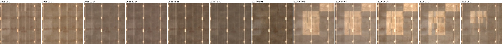
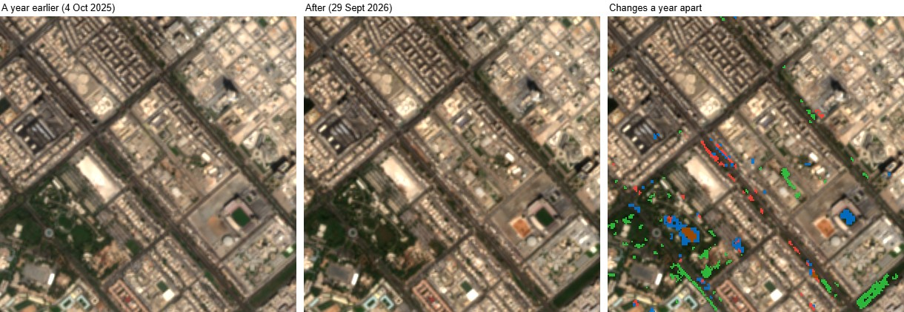
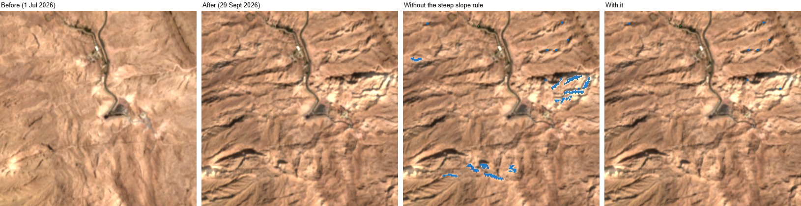
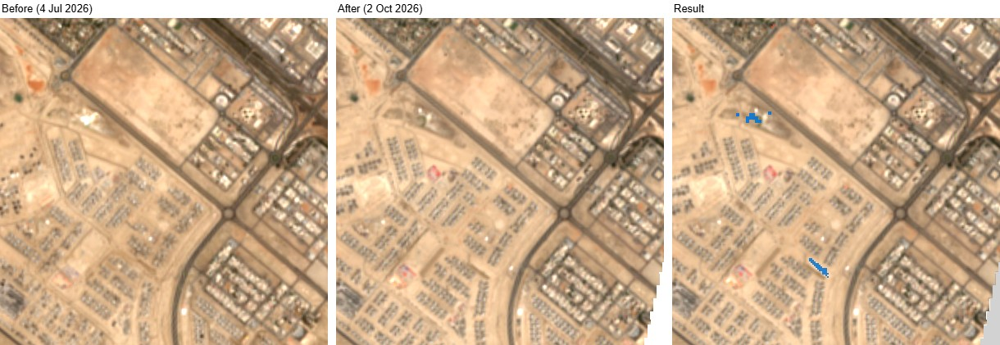
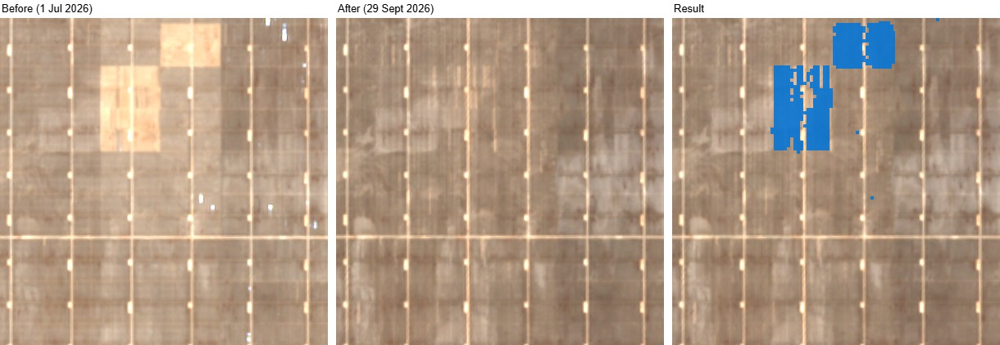

# Validation: does the change detection find real change?

The tool was first tested on **4 October 2026** on six sites around Abu Dhabi: three with real change and three where nothing should have changed. That test found three weak spots, and the rules were then changed to fix them. All six sites were run again with the new rules, plus **two new sites** that hadn't been tested before. This page gives the results before and after the changes. Later, a ninth site, the mountain **Jebel Hafeet**, showed a new kind of false alarm, which the terrain now removes (see [Steep slopes](#steep-slopes-jebel-hafeet)).

Every site used the dates **3 July to 1 October 2026** (90 days) and a box about **2 km × 2 km** (401 ha) centred on the coordinates below. Each site was run through the website in Chrome exactly as a user would, with the default settings.

## What changed in the rules

| Weak spot in the first test | Change | Details |
|---|---|---|
| A plot covered in **bright white fill** was missed, because the built-up score went *down* | **Bright new surfaces** are now counted as new buildings or bare ground: squares that got at least 30% brighter in visible light than the area as a whole, end up brighter than the area's usual ground, brightened more in visible light than in short-wave infrared, and form a patch of at least 2,500 m² | [README, 4b](README.md#4b-bright-new-surfaces) |
| A **solar panel field** that didn't change was flagged | Surfaces that were **already dark** before (less than 80% as bright as the area's usual ground) and **only got darker** no longer count as new buildings. Dust being cleaned off panels does this, and so do longer shadows on dark roofs | [README, 4](README.md#4-ignoring-small-and-fake-changes) |
| **Lawns greening** after the summer were flagged as plants gained | When the two images are from **different seasons**, the panel warns that some plant changes may be seasonal and offers **Compare with a year earlier**. That compares the after image with one from a year before, and says how much plant change is probably seasonal | [README, 4c](README.md#4c-seasons) |

The rules were made general, not tuned to these sites. Every check is measured against the area's own typical value (which takes out haze and the sun's angle), or has a physical reason. For example, ground drying out brightens most in short-wave infrared because water absorbs that light, while new fill brightens most in visible light. The settings were first tried on band values saved from the six old sites, so those six aren't an independent test of them. The two new sites are.

## Results

| # | Site | Centre (lat, lng) | Expected | First test | With the new rules | Correct? (first → new) |
|---|---|---|---|---|---|---|
| 1 | Khalifa City south (cleared plot) | 24.3902, 54.5501 | **Change**: a plot covered in bright white fill; a strip of planting turned greener | 6.5 ha changed (1.6%). **The white plot was not flagged** | 12.6 ha (3.1%). New buildings or bare ground 7.0 ha, **6.5 ha of it bright new surface**: the white plot's outer parts and two white strips at the top. **The plot's centre is still not flagged** (see below). Plants gained 5.5 ha, as before | ⚠️ → ⚠️ Partly, but much better: **most of the white plot is now found** |
| 2 | Lulu Island (new park, earthworks, sand fill) | 24.4943, 54.3450 | **Change** | 10.6 ha (2.8%). New buildings or bare ground 9.7 ha on the earthworks and around the new park | 14.5 ha (3.9%). New buildings or bare ground 13.6 ha, **5.1 ha of it bright new surface**: more of the white sand spread over the earthworks at the top. Also two thin lines along the shore | ✅ → ✅ Yes, and more of the earthworks found |
| 3 | Masdar City construction | 24.4270, 54.6150 | **Change**: buildings going up | 4.9 ha (1.2%). New buildings or bare ground 4.6 ha, **about 3 ha of it on a solar panel field** that didn't change | 1.8 ha (0.4%). New buildings or bare ground 1.5 ha. **The solar field box went from 3.1 ha to 0.9 ha**, and some of that 0.9 ha is the building site at its top edge. But fewer squares on the construction plots are flagged too, because new buildings that are dark, next to dark buildings, look like the same kind of darkening | ⚠️ → ⚠️ Partly: far fewer false alarms, but also less of the construction found |
| 4 | Al Khalidiyah (old neighbourhood) | 24.4690, 54.3500 | **No change** | 2.8 ha (0.7%), all small specks | 2.0 ha (0.5%), all small specks | ✅ → ✅ Yes |
| 5 | Al Mushrif and Umm Al Emarat Park | 24.4560, 54.3860 | **No change** (established park) | 14.2 ha (3.5%). Plants gained 8.7 ha from lawns greening after the summer | 12.0 ha (3.0%). Plants gained 8.7 ha, as before. **The seasonal warning is shown**, and the year-apart check says **6.6 of the 9.0 ha of plant change (73%) is probably seasonal** | ❌ → ❌ Still too much flagged, but the page now warns that most of it is probably seasonal |
| 6 | Khalifa City A (finished villas) | 24.4200, 54.5750 | **No change** | 1.4 ha (0.4%), small specks | 1.3 ha (0.3%), small specks | ✅ → ✅ Yes |
| 7 | **New:** Riyadh City (new villas) | 24.2772, 54.6388 | **Change**: rows of new villas going up across the left half | (not tested) | 0.9 ha (0.2%): two small patches. **The new villas were not found** | ❌ No |
| 8 | **New:** Dubai solar park (existing panel field) | 24.7091, 55.4439 | **No change** (expected, see below) | (not tested) | 25 ha (6.3%) new buildings or bare ground, all in three blocks of the field. The rest of the panel field (about 375 ha): almost nothing | ✅ Yes: those three blocks really had changed (see below) |
| 9 | **New:** Jebel Hafeet (mountain) | 24.0590, 55.7760 | **No change** (checked by eye) | (not tested) | Without the steep slope rule: 4.6 ha (1.1%), 4.3 ha of it bright new surface on sunlit ridges. With it: 2,800 m² (0.1%) | ✅ Yes, with the steep slope rule (see [Steep slopes](#steep-slopes-jebel-hafeet)) |

**Score with the new rules: 5 correct, 2 partly correct and 2 wrong** (first test, six sites: 3 correct, 2 partly, 1 wrong). The three new sites: 2 correct, 1 wrong. All the before and after images came from the same satellite path, with 0–7% cloud over the area.

### What counted as correct

These rules were set **before** running the tool, as in the first test:

- **Change sites**: correct if the flagged squares fall on the patch that visibly changed, as the right kind of change.
- **Stable sites**: correct if less than 1% of the area is flagged and there are no sizeable patches on ground that didn't change.

### The Dubai solar park: the expectation was wrong

This site was chosen as a panel field that didn't change: high-resolution photos show panels across the whole box, and the field was finished years ago. In the July image, three blocks of the field looked like bare sand, and they were dark like the rest by late September. The tool flagged exactly those blocks.

To check, the same spot was looked at in 12 clear images from June 2025 to August 2026 (picture below). The blocks had panels until February 2026, were **bare sand from May to July 2026**, and had panels again by late August. So panels really were taken out and put back, and the flag is right.

This was found **after** running the tool. The site is counted as correct, but it was a real change, not the "nothing changed" test it was meant to be. The other 375 ha of panels, which did stay the same, had almost nothing flagged, so it does show **a second solar field that didn't change was left alone**. The old rules leave it alone too, though: these panels didn't change much between the two dates, unlike Masdar's. So this site doesn't test the new solar rule much.

### Year-apart check on every site

All eight sites compare summer (July) with autumn (September/October), so **the seasonal warning appeared on every site**. The year-apart check (after image against an image from a year earlier, same satellite path) was run on all of them:

| Site | Plant change between the chosen dates | Probably seasonal (not seen a year apart) |
|---|---|---|
| Khalifa City south | 5.6 ha | 4.5 ha (82%) |
| Lulu Island | 8,500 m² | 7,000 m² (82%) |
| Masdar City | 2,700 m² | 2,700 m² (100%) |
| Al Khalidiyah | 1.2 ha | 4,500 m² (36%) |
| **Al Mushrif park** | **9.0 ha** | **6.6 ha (73%)** |
| Khalifa City A | 6,400 m² | 3,900 m² (61%) |
| Riyadh City | 200 m² | 200 m² (100%) |
| Dubai solar park | 0 m² | (nothing to explain) |

The percentages are the ones the page shows, worked out from the exact number of squares, so they can differ a little from dividing the rounded sizes.

At the park, most of the lawn greening is correctly marked as probably seasonal. The rest (2.4 ha) includes a tree-lined road that also got greener over the whole year. Keep in mind that a year apart is itself a comparison: real changes made during that year show up in it too.

## Steep slopes: Jebel Hafeet

**The problem.** When terrain was added, the change detection was also run on Jebel Hafeet, the mountain near Al Ain (2 km box centred on 24.0590, 55.7760, images from 1 July and 29 September 2026, same satellite path, 0% cloud). Nothing was built there in those months: the road, the buildings and the bare rock look the same in both photos. But **4.3 ha was marked as bright new surface**. In July the sun is almost overhead and the mountain looks evenly lit. By late September it is lower, so the ridges facing it light up and the slopes facing away fall into shade. The lit ridges got much brighter in visible light, which is exactly what the bright new surface rule looks for.

**The rule.** The terrain tab already works out the slope of every 30 m square. Brightening on ground with a slope of **15° or more** no longer counts as a bright new surface, and the page and report say how much was left out this way. Only this rule uses the slope. Plants, burns and the built-up score work as before, and on flat ground nothing changes.

**Why 15°.** At Jebel Hafeet the squares it removed had slopes of 25° to 53° (from the 10% to the 90% mark). In the towns of the other sites, nothing flagged as change was on a slope of 15° or more: 99% of it was under 12°, even though the elevation model includes buildings. So any limit from about 15° to 25° gives the same results here, and 15° leaves room for gentler hills.

**Results on all nine sites**, without and with the rule (same images and dates as above):

| Site | Bright new surface without the rule | With it | Left out (steep) | All new buildings or bare ground, without → with |
|---|---|---|---|---|
| Khalifa City south | 6.5 ha | 6.5 ha | 0 | 7.0 ha → 7.0 ha |
| Lulu Island | 5.1 ha | 5.1 ha | 0 | 13.6 ha → 13.6 ha |
| Masdar City | 0 | 0 | 0 | 1.5 ha → 1.5 ha |
| Al Khalidiyah | 0 | 0 | 0 | 7,200 m² → 7,200 m² |
| Al Mushrif park | 0 | 0 | 0 | 2.5 ha → 2.5 ha |
| Khalifa City A | 0 | 0 | 0 | 6,200 m² → 6,200 m² |
| Riyadh City | 4,000 m² | 4,000 m² | 0 | 8,400 m² → 8,400 m² |
| Dubai solar park | 0 | 0 | 0 | 25.0 ha → 25.0 ha |
| **Jebel Hafeet** | **4.3 ha** | **0** | **4.3 ha** | **4.6 ha → 2,700 m²** |

**In simple words:** the mountain false alarm is gone, and nothing changed anywhere else, so no real change was hidden at these sites. Jebel Hafeet now has 2,800 m² (0.1%) flagged, under the 1% for a correct "no change" site. The 2,700 m² of new buildings or bare ground left there comes from the built-up score, not brightening, on very steep slopes (37° to 46°): probably also the light, but the rule doesn't touch it.

## In simple words

**What got better**

- **White fill is now found.** At Khalifa City south most of the white plot is flagged (6.5 ha of bright new surface), where the first test found none of it. At Lulu Island more of the white sand on the earthworks is found.
- **The solar field false alarm is mostly gone.** At Masdar it went from about 3 ha to under 1 ha.
- **Seasonal greening is explained.** The page warns when the dates are in different seasons, and the year-apart check put 73% of the park's "plants gained" down as probably seasonal.
- **Stable neighbourhoods got a little quieter** (Al Khalidiyah 0.7% → 0.5%).

**What is still weak**

- **Fill on ground that was wet before is still missed.** The centre of the Khalifa City plot was wet, dark ground in July (very dark in short-wave infrared) and white in September. Wet ground drying out turns pale too, and on this coast that is the most common false alarm, so wet ground is always left out. The tool can't tell fill on wet ground from wet ground drying.
- **New buildings that are dark and stand among dark buildings can be missed**, because they look the same as dust being cleaned off. At Masdar, less of the construction is flagged than before.
- **Scattered single villas are too small.** At Riyadh City whole streets of villas went up, but each house is about one 10 m square, with bare plots between them. The old rules miss them too (0.4 ha flagged).
- **Lawns still show as "plants gained"** between seasons. The warning and the year-apart check explain it, but don't remove it from the map.
- A few thin lines along shorelines at Lulu Island were flagged as bright new surface.
- **Bright fill on a steep slope wouldn't be found** since the steep slope rule, for example on terraced earthworks on a hillside. None of the sites here had any.

**Bottom line**: better at bright building sites and solar farms, and honest about seasons. It is still a first look for *where* to check, best for building sites larger than a few plots. Always look at the before and after photos with the slider before believing a result.

## Burned areas

Burn detection was added later (see the README for the rules) and tested separately. The new rules don't change it: the burn check comes first, and a burned square is never also counted as a bright new surface. The burn tests below were not re-run.

### A real fire: Palisades, Los Angeles, January 2025

The Palisades fire started on 7 January 2025 and burned 23,449 acres (9,489 ha), both wild hillside scrub (Topanga State Park) and streets of houses (Pacific Palisades). The tool was run on a **7.4 km × 6.6 km box** (34.040 to 34.100 N, 118.600 to 118.520 W) with dates **10 December 2024 and 5 February 2025**. Those dates were chosen so the 20-day image search couldn't pick an image taken during the fire. It chose images from **18 December 2024 and 21 February 2025**, from the same satellite path, both with 0% cloud.

The result was compared with the **official fire perimeter** from CAL FIRE (4,322 ha of it falls inside the box):

| Measure | Result |
|---|---|
| Squares marked burned that are inside the official perimeter | **99.7%** (only 7 ha outside) |
| Burned land (inside the perimeter) marked **burned** | **64%** |
| ...marked as another change instead: plants lost / new buildings or bare ground | 21% / 3% |
| ...with no change marked | 13%. Perimeters also include patches that didn't burn, like the houses in Palisades Highlands that were saved |

**In simple words:** when it says "burned", it's almost always right. It finds most of a large fire, but some burned ground shows up as "plants lost" instead, mostly where pale ash made the ground brighter in near-infrared. The unburned village of Topanga, just outside the perimeter, was correctly left clear.

### Things that must not look like burns

The same rules were run on places with dark shadows, water, dark roofs and wet ground around Abu Dhabi, where there was no fire:

| Site | Dates | Why it's a trap | Marked burned |
|---|---|---|---|
| Al Khalidiyah | 10 Dec 2025 – 16 Jun 2026 | Long winter shadows from towers | 1,600 m² (<0.1%) |
| Masdar City | 1 Jul – 29 Sep 2026 | Dark solar panels, new dark roofs | 0 m² |
| Lulu Island | 6 Jul – 29 Sep 2026 | Water, new lagoon, fresh sand | 400 m² (<0.1%) |
| Fahid Island tidal flats | 6 Jul – 29 Sep 2026 | Wet mud with green algae, drying out | 4,900 m² (0.1%) |
| Al Mushrif and Umm Al Emarat Park | 1 Jul – 29 Sep 2026 | Lawns and trees | 4,000 m² (0.1%) |

The first version of the rules marked **11 ha of the Fahid tidal flats as burned**. Wet mud with a thin green film of algae looks like "plants" before, and drying out lowers NBR just like a fire. The band values were compared: the mud got **brighter** in near-infrared (median 1.6 times), while real burns got **darker** (median 0.7 times). So the rule "near-infrared must go down" was added. It removed 96% of those false burns, but it also moved about a fifth of the real Palisades burns into "plants lost", which is why 64% are marked burned rather than 79%. For a tool used mostly around coastal Abu Dhabi, avoiding false fires on tidal flats seemed worth it.

## How the sites were chosen

1. **Change sites (first test).** Three construction or clearing sites were needed, found without using the tool itself:
   - A coarse scan of the whole Abu Dhabi area (100 m squares) listed places where the ground changed a lot between early July and late September.
   - Most of those turned out to be **natural**: salt flats whose white summer crust faded, and tidal mud drying out. So development districts were then searched by eye on 8 km wide before/after photos.
   - The three sites used are ones where **change was clearly visible** in the 10 m before and after photos.
2. **Stable sites (first test).** Two neighbourhoods finished long ago, and one with an established park, also checked by eye to look unchanged.
3. **New sites.** Chosen by eye before running the tool, to test the new rules somewhere they hadn't been tried:
   - **Riyadh City**, a new town south of Abu Dhabi, where 6 km wide before/after photos showed streets of villas going up.
   - **Dubai solar park**, a panel field that high-resolution photos show was finished long ago, to test the solar rule on a second solar farm (it turned out to have changed; see above).
4. **Jebel Hafeet** was added after the terrain was, as a steep site where nothing changed between July and September (checked by eye on the photos).

The salt flats and tidal mud found during the first search weren't run through the tool. The tool leaves out water, ground that was wet before and ground near water, which should remove most tidal changes, but salt flats were not tested. A salt crust forming (rather than fading) would look like a bright new surface.

## Pictures

Each picture shows the before photo, the after photo and the results drawn on the after photo: for the first six sites, the first test's result and the new result side by side. Green = plants gained, red = plants lost, blue = new buildings or bare ground, grey = skipped.

**1. Khalifa City south**: the old result has no squares on the white plot; the new one outlines most of it. The centre, which was wet before, is still clear.

**2. Lulu Island**: more blue on the white sand spread over the earthworks at the top.

**3. Masdar City**: the solar panels in the top-left corner are mostly clear now. A few squares remain, and fewer on the construction plots.

**4. Al Khalidiyah**: only specks, fewer than before.

**5. Al Mushrif and Umm Al Emarat Park**: still green on the park lawns (bottom left) and a tree-lined road (bottom right). See the year-apart picture above.

**6. Khalifa City A**: only specks.

**7. Riyadh City (new)**: rows of new villas on the left in the after photo, almost nothing flagged.

**8. Dubai solar park (new)**: the three blocks that were bare sand in July and had panels again by September.

**9. Jebel Hafeet**: see [Steep slopes](#steep-slopes-jebel-hafeet) above.

## Running this check yourself

All nine sites can be re-run with `npm run test:validation` (see [Running the tests](README.md#running-the-tests) in the README). It runs each site in headless Chrome exactly as above, checks it against the "what counted as correct" rules, and saves the numbers in `test-output/validation.json`. GitHub runs it every Monday as well. The burn sites and the pictures on this page aren't part of it.

## Limits of this check

- **Nine sites is a small test.** It shows the kinds of mistakes the tool makes, not exact accuracy figures.
- **The new settings were tried out on the first six sites' data** before the re-run, so those six results are a best case. The two new sites are the fairer test, and one of them turned out not to be the "no change" site it was chosen as.
- **One season only** (July to October). Results for other times of year may differ, especially for plants and for brightening (a salt crust forming in spring could look like a bright new surface).
- **"Real change" was judged by eye** on the same 10 m Sentinel-2 photos, plus high-resolution photos of unknown date for the solar park, not checked on the ground. Changes too small to see in these photos couldn't be judged.
- The burn tests and the tidal-flat site weren't re-run with the new rules.
